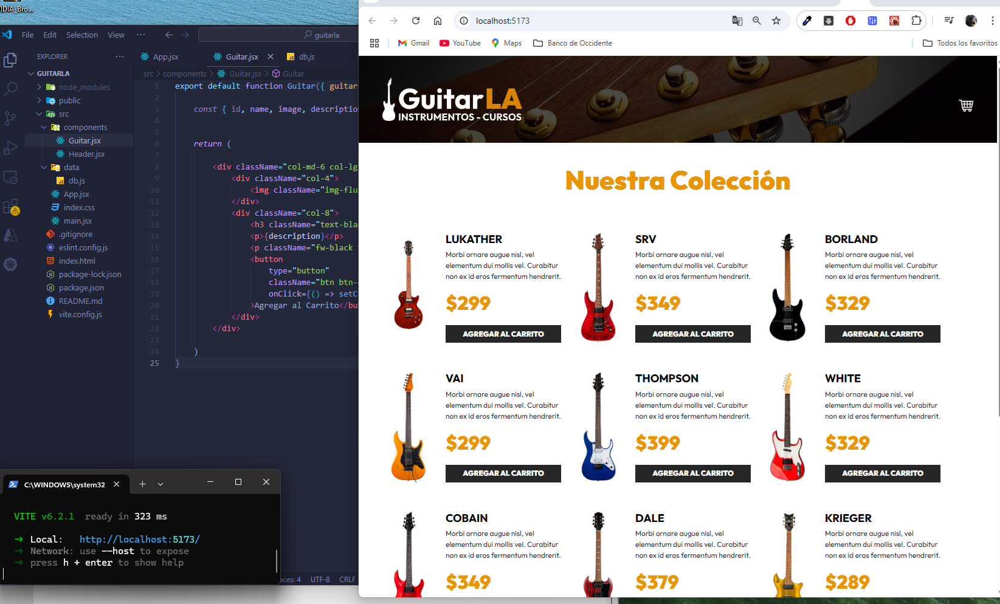

# React + Vite

Proyecto de aprendizaje en React, empleando Vite y tambien TypeScript,
en donde se pueden adicionar productos al carrito y totalizarlos de acuerdo al precio de cada uno, los datos de los productos se almacenan
en un JSON.

Demo del aplicativo web:

